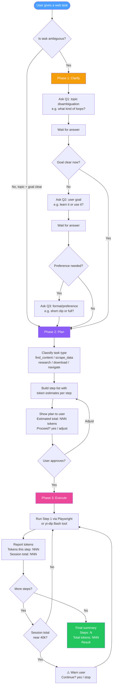
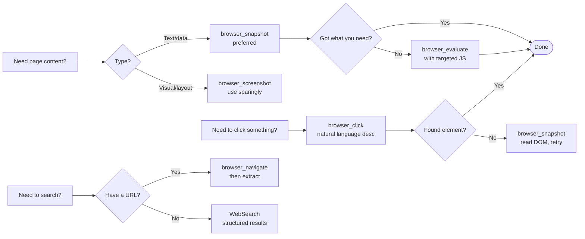
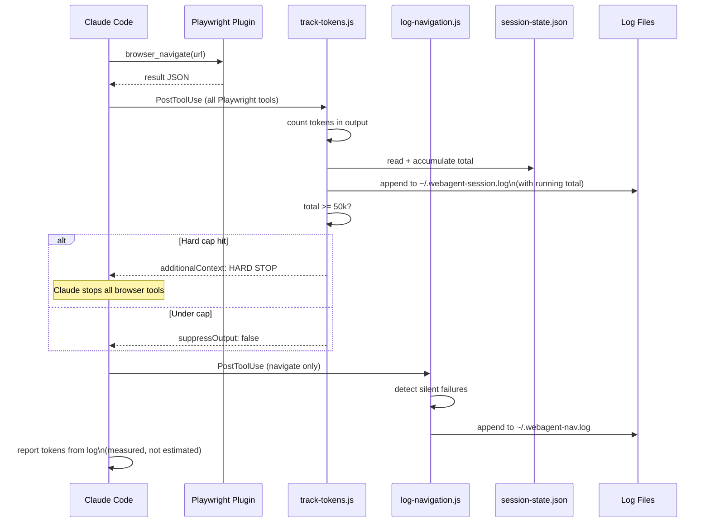

# claude-skills

A growing collection of Claude Code skills and plugins. Currently ships one plugin: **webagent** — intelligent browser automation with planning, token tracking, and a 50k hard cap.

No server. No MCP libraries. No supply chain risk.

---

## Table of Contents

- [Skills in this repo](#skills-in-this-repo)
- [How WebAgent Works](#how-webagent-works)
- [File Structure](#file-structure)
- [Code Logic — Deep Dive](#code-logic--deep-dive)
- [All Tools Reference](#all-tools-reference)
- [Usage Examples](#usage-examples)
- [Hooks](#hooks)
- [Install](#install)
- [Download Quality Reference](#download-quality-reference)
- [Security](#security)

---

## Skills in this repo

| Skill | What it does |
|---|---|
| `webagent` | Browser automation — navigate, scrape, research, download with 3-phase planning and token tracking |

---

## How WebAgent Works



---

## File Structure

```
claude-skills/
│
├── .claude-plugin/
│   └── plugin.json              ← Plugin identity — Claude Code reads this to register all skills
│
├── skills/
│   └── webagent/
│       └── SKILL.md             ← All intelligence — the complete cognitive model for web automation
│
├── hooks/
│   ├── track-tokens.js          ← PostToolUse hook — cumulative token tracking + 50k hard cap kill
│   ├── log-navigation.js        ← PostToolUse hook — URL history + silent failure detection
│   └── settings-snippet.json   ← Copy-paste into ~/.claude/settings.json to enable hooks
│
└── README.md
```

Adding a new skill: create `skills/<name>/SKILL.md` — no other config needed.

### Why no tool code?

This plugin layers a **cognitive model** on top of tools Claude Code already has:

| Tool source | What it provides |
|---|---|
| Playwright plugin (pre-installed) | Browser control — navigate, click, extract, screenshot |
| Claude Code built-in | Web search, Bash execution |
| **This plugin (SKILL.md)** | **The thinking layer** — when to ask, how to plan, how to track |

---

## Code Logic — Deep Dive

### `plugin.json` — Plugin Registration

```json
{
  "name": "webagent",
  "description": "Browser automation skill...",
  "author": { "name": "Aakashjammula" },
  "version": "1.0.0"
}
```

Claude Code scans `~/.claude/plugins/` for directories containing `.claude-plugin/plugin.json`. When found, it registers the plugin and loads any `skills/` inside it. Without this file, the skill directory is invisible to Claude Code.

---

### `SKILL.md` — The Cognitive Model

The entire intelligence of the plugin. A markdown file that instructs Claude *how to think and act* for any web task.

#### Frontmatter — Skill Registration

```yaml
---
name: webagent
description: Browser automation skill — activates for any web navigation...
---
```

The `description` field is what Claude Code uses to match this skill to user requests. A precise description means the skill loads only when relevant — saving tokens.

#### Phase 1 Logic — Intent Clarification

**Most agents fail because they act before understanding.** Phase 1 enforces a strict question order before any browser action:

```
1. Topic disambiguation  → What exactly does the user mean?
2. User goal             → What are they trying to achieve?
3. Format/preference     → Only if still needed after 1 and 2
```

Task types and their question flows:

```
find_content  → videos, articles, examples, demos
scrape_data   → structured data extraction
research      → gather and compare information
download      → video/audio/file download (defaults to ~/Downloads/webagent)
navigate      → deterministic URL + action (skips Phase 1 entirely)
```

**Why one question at a time?** Multiple questions overwhelm users and produce incomplete answers. One question → wait → one answer produces better context with fewer wasted tokens.

#### Phase 2 Logic — Step Planning

Before any browser action, the skill produces a gated plan:

```
Step 1: Navigate to youtube.com           [~180 tokens]
Step 2: Search for query                  [~150 tokens]
Step 3: Scan results                      [~300 tokens]
Estimated total: ~630 tokens
Proceed? (yes / adjust)
```

Token estimation formula:
```
estimate_A = characters_in_expected_output ÷ 4
estimate_B = words_in_expected_output × 1.3
tokens = ceil(average(estimate_A, estimate_B) / 10) × 10
```

Nothing runs until the user says "yes".

#### Phase 3 Logic — Execution with Token Tracking

Steps execute one at a time. After each:

```
✓ Step N: [what was done]
  Tokens this step: NNN  |  Session total: NNN
```

If hooks are enabled, token counts come from `~/.webagent-session.log` — **measured from the actual tool output**, not estimated. The 40k warning fires before any step that would push the session above the threshold.

#### Output Folder

All output — downloads and scraped files — saves to `~/Downloads/webagent/`. Never to cwd or the repo.

---

### `hooks/track-tokens.js` — Token Counting + 50k Hard Cap

```js
// Load or reset session state (resets after 2 hours idle = new session)
let state = { total: 0, updatedAt: Date.now() };
try {
  const saved = JSON.parse(fs.readFileSync(statePath, 'utf8'));
  if (Date.now() - saved.updatedAt < SESSION_TIMEOUT_MS) state = saved;
} catch {}

state.total += tokens;
fs.writeFileSync(statePath, JSON.stringify(state));

// Debug log — running total on every line
fs.appendFileSync(logPath,
  `${new Date().toISOString()} | ${tool} | ${tokens} tokens | session total: ${state.total}\n`
);

// Hard cap — kill the session at 50k
if (state.total >= TOKEN_CAP) {
  console.log(JSON.stringify({
    additionalContext: `[WEBAGENT HARD STOP] Session total (${state.total}) exceeded ${TOKEN_CAP} cap. Stop all browser tools immediately.`
  }));
}
```

**How it fits in:** Claude Code fires `PostToolUse` after every Playwright tool call. The hook reads tool output from stdin, counts tokens (chars ÷ 4, words × 1.3, averaged), accumulates into `~/.webagent-session-state.json`, and appends to `~/.webagent-session.log` with the running total on every line.

At 50,000 tokens, it injects a `additionalContext` hard stop that forces Claude to halt all further browser tool calls and report to the user.

State resets automatically after 2 hours idle (new session assumed). Delete `~/.webagent-session-state.json` to reset manually.

**Why Node.js?** Cross-platform (Windows/Mac/Linux), no dependencies, reads stdin natively. Any error exits cleanly with code 0 — the hook never blocks the agent.

---

### `hooks/log-navigation.js` — URL History + Silent Failure Detection

```js
// Log every navigation
fs.appendFileSync(logPath, `${new Date().toISOString()} | ${url}\n`);

// Flag silent failures Claude might not surface
const silentFail =
  lower.includes('net::err') || lower.includes('timeout') ||
  lower.includes('page crashed') || lower.includes('navigation failed');

if (silentFail) {
  fs.appendFileSync(logPath,
    `${new Date().toISOString()} | SILENT FAILURE at ${url} | ${output.substring(0, 400)}\n`
  );
}
```

Fires after every `browser_navigate` call. Logs timestamp + URL to `~/.webagent-nav.log`. Detects network errors, timeouts, page crashes, and navigation failures — flags them as `SILENT FAILURE` so they appear in the log even when Claude doesn't mention them. Hook errors themselves are logged too.

---

## All Tools Reference

### Browser Tools (Playwright plugin)

| Tool | What it does | When to use | Token cost |
|---|---|---|---|
| `browser_navigate(url)` | Go to a URL | Starting point for any web task | 100–200 |
| `browser_snapshot()` | Get page accessibility tree | Reading page content — preferred over screenshot | 200–500 |
| `browser_screenshot()` | Capture page as image | Visual/dynamic pages, hard to read as text | 300–800 |
| `browser_click(element)` | Click by description | Buttons, links, tabs, dropdowns | 50–100 |
| `browser_type(element, text)` | Type into an input | Search boxes, forms, login fields | 50–100 |
| `browser_select_option(element, value)` | Select from dropdown | Quality selectors, filter menus | 50–100 |
| `browser_press_key(key)` | Press a keyboard key | Enter after search, Escape to close | 30–50 |
| `browser_hover(element)` | Hover over an element | Tooltips, dropdown menus | 30–50 |
| `browser_wait_for(condition)` | Wait for element or state | Dynamic pages, SPAs, lazy loading | 50–100 |
| `browser_evaluate(js)` | Run JavaScript in the page | Extracting values no other tool reaches | 50–500 |
| `browser_network_requests()` | List network requests | Finding API endpoints | 200–400 |
| `browser_fill_form(fields)` | Fill multiple fields at once | Registration forms | 100–200 |
| `browser_navigate_back()` | Go back in history | Returning from a result page | 50–100 |
| `browser_tabs()` | List open tabs | Multi-tab workflows | 50–100 |

### Web Search (Claude Code built-in)

| Tool | What it does | When to use |
|---|---|---|
| `WebSearch(query)` | Search the web, return structured results | Starting research without a specific URL |

### Download Tools (Bash + yt-dlp)

All downloads save to `~/Downloads/webagent/`. Audio always uses `[ext=m4a]` and video `[ext=mp4]` to prevent silent-audio bugs.

| Command | What it does |
|---|---|
| `yt-dlp --list-formats <url>` | Show all available formats before downloading |
| `yt-dlp -f "bestvideo[ext=mp4]+bestaudio[ext=m4a]/best[ext=mp4]/best" --merge-output-format mp4 -P "~/Downloads/webagent"` | 4K download |
| `yt-dlp -f "bestvideo[height<=1080][ext=mp4]+bestaudio[ext=m4a]/best[height<=1080][ext=mp4]/best" --merge-output-format mp4 -P "~/Downloads/webagent"` | 1080p download |
| `yt-dlp -f "bestvideo[height<=720][ext=mp4]+bestaudio[ext=m4a]/best[height<=720][ext=mp4]/best" --merge-output-format mp4 -P "~/Downloads/webagent"` | 720p download |
| `yt-dlp -x --audio-format mp3 --audio-quality 0 -P "~/Downloads/webagent"` | Audio only — MP3 |
| `yt-dlp -x --audio-format m4a -P "~/Downloads/webagent"` | Audio only — M4A |

### Tool Priority Order



---

## Usage Examples

### Find a video

```
go to youtube and find me a video on Claude Code hooks
```

1. Classifies as `find_content`
2. Asks: "Claude Code lifecycle hooks, Git hooks, or something else?"
3. You: "Claude Code lifecycle hooks"
4. Asks: "Learning how to set one up, or understanding what events exist?"
5. You: "set one up"
6. Plan: navigate → search → scan results → recommend
7. Executes step by step with token counts

---

### Scrape a docs page

```
go to docs.aws.amazon.com/bedrock and find all Moonshot AI model documents
```

1. Classifies as `scrape_data`
2. Navigates, searches docs, visits each Moonshot AI page
3. Extracts full content
4. Saves result to `~/Downloads/webagent/aws-bedrock-moonshot-docs.md`

---

### Download a YouTube video

```
download https://youtube.com/watch?v=dQw4w9WgXcQ
```

1. Classifies as `download`
2. Asks: "Offline viewing, video editing, or audio only?"
3. You: "offline viewing"
4. Runs `yt-dlp --list-formats`, shows quality table
5. You: "1080p"
6. Creates `~/Downloads/webagent/`, runs download with `[ext=mp4]+[ext=m4a]` format
7. Reports: `Saved to ~/Downloads/webagent/<title>.mp4`

---

### Navigate and interact

```
go to github.com/settings and find where to enable two-factor authentication
```

1. Classifies as `navigate` — deterministic, skips Phase 1
2. Plan: navigate → find security section → locate 2FA → report
3. Executes and reports the exact path

---

### Research and compare

```
search for the best note-taking apps and compare their pricing
```

1. Classifies as `research`
2. Asks: "Personal use, team use, or something else?"
3. You: "team use"
4. Searches, visits top results, extracts pricing
5. Saves `~/Downloads/webagent/note-taking-apps-comparison.md`

---

## Hooks

Two PostToolUse hooks fire after every Playwright browser action.



### Setup

**Step 1 — Set `CLAUDE_SKILLS_DIR` as a permanent environment variable** (do this once, survives renames):

```powershell
# Windows — run in PowerShell, then restart terminal
[Environment]::SetEnvironmentVariable('CLAUDE_SKILLS_DIR', 'C:\path\to\claude-skills', 'User')
```

```bash
# Mac / Linux — add to ~/.zshrc or ~/.bashrc
export CLAUDE_SKILLS_DIR="/path/to/claude-skills"
```

**Step 2 — Copy into `~/.claude/settings.json`:**

```json
{
  "hooks": {
    "PostToolUse": [
      {
        "matcher": "mcp__plugin_playwright_playwright__.*",
        "hooks": [
          {
            "type": "command",
            "command": "node \"$CLAUDE_SKILLS_DIR/hooks/track-tokens.js\""
          }
        ]
      },
      {
        "matcher": "mcp__plugin_playwright_playwright__browser_navigate",
        "hooks": [
          {
            "type": "command",
            "command": "node \"$CLAUDE_SKILLS_DIR/hooks/log-navigation.js\""
          }
        ]
      }
    ]
  }
}
```

> If you rename or move the repo, update `CLAUDE_SKILLS_DIR` — nothing else needs to change.

### Log files

| File | Contents |
|---|---|
| `~/.webagent-session.log` | `2026-06-15T10:23:44Z \| browser_navigate \| 142 tokens \| session total: 4821` |
| `~/.webagent-session.log` | `2026-06-15T10:45:00Z \| HARD STOP \| session total 50142 exceeded 50000 cap` |
| `~/.webagent-nav.log` | `2026-06-15T10:23:44Z \| https://youtube.com` |
| `~/.webagent-nav.log` | `2026-06-15T10:24:01Z \| SILENT FAILURE at https://example.com \| net::ERR_NAME_NOT_RESOLVED` |
| `~/.webagent-session-state.json` | `{"total": 4821, "updatedAt": 1749985424000}` — delete to reset session |

---

## Install

```bash
# 1. Clone
git clone <repo-url>
cd claude-skills

# 2. Install the plugin
claude plugin install .

# 3. Install the Playwright plugin (required for browser tools)
claude plugin install playwright

# 4. (Optional) Enable hooks
#    Copy hooks/settings-snippet.json into ~/.claude/settings.json
#    Replace /full/path/to/claude-skills with your actual clone path

# 5. yt-dlp + ffmpeg (Windows — for downloads)
winget install yt-dlp.yt-dlp --accept-source-agreements --accept-package-agreements
winget install Gyan.FFmpeg --accept-source-agreements --accept-package-agreements
# Then add yt-dlp to PATH — see hooks/settings-snippet.json for the PowerShell snippet
```

---

## Download Quality Reference

| Quality | Streams | FFmpeg | Approx size (10 min) | Best for |
|---|---|---|---|---|
| 4K (2160p) | video + audio → merged | Required | 2–4 GB | Archiving, editing |
| 1440p | video + audio → merged | Required | 600 MB–1 GB | High-res viewing |
| 1080p | video + audio → merged | Required | 300–600 MB | Offline viewing |
| 720p | video + audio → merged | Required | 100–200 MB | Casual viewing |
| 480p | video + audio → merged | Required | 50–100 MB | Low storage |
| MP3 | audio only | Required (convert) | 15–25 MB | Music, podcasts |
| M4A | audio only | Not needed | 20–30 MB | Best audio quality |

> Always use `[ext=mp4]+[ext=m4a]` — `bestaudio` alone picks opus/webm which causes silent audio in most mp4 players.

---

## Security

This plugin uses **no third-party MCP libraries** — [which have documented RCE vulnerabilities](https://www.ox.security/blog/mcp-supply-chain-advisory-rce-vulnerabilities-across-the-ai-ecosystem/). It is a pure skill plugin:

- `plugin.json` — 6 lines of JSON
- `SKILL.md` — plain markdown, no executable code
- `hooks/*.js` — two small Node.js scripts, fully readable in under 2 minutes
- No network calls, no background processes, no ports opened

The only executables are `yt-dlp` and `ffmpeg` — both open source, widely audited, installed via official package managers.
