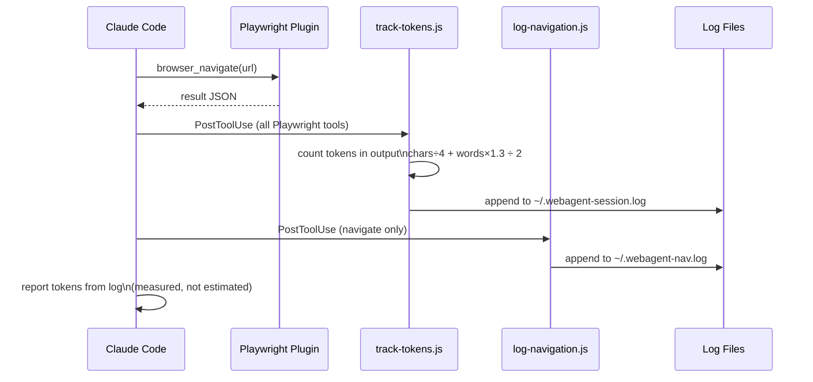

# WebAgent — Browser Automation Plugin for Claude Code

A Claude Code plugin that gives any AI agent intelligent web automation. Navigate sites, scrape content, search the internet, and download videos — with automatic step planning, token tracking, and clarifying questions before acting.

No server. No MCP libraries. No supply chain risk. Two files.

---

## Table of Contents

- [How It Works](#how-it-works)
- [File Structure](#file-structure)
- [Code Logic — Deep Dive](#code-logic--deep-dive)
- [All Tools Reference](#all-tools-reference)
- [Usage Examples](#usage-examples)
- [Hooks](#hooks)
- [Install](#install)
- [Download Quality Reference](#download-quality-reference)

---

## How It Works


---

## File Structure

```
webagent-plugin/
│
├── .claude-plugin/
│   └── plugin.json              ← Plugin identity — Claude Code reads this to register the plugin
│
├── skills/
│   └── webagent/
│       └── SKILL.md             ← All intelligence — the complete cognitive model for web automation
│
├── hooks/
│   ├── track-tokens.js          ← PostToolUse hook — counts real tokens from every Playwright call
│   ├── log-navigation.js        ← PostToolUse hook — logs every URL visited to session history
│   └── settings-snippet.json   ← Copy-paste this into ~/.claude/settings.json to enable hooks
│
└── README.md
```

### Why only 2 core files?

This plugin adds no new tools — it layers a **cognitive model** on top of tools Claude Code already has:

| Tool source | What it provides |
|---|---|
| Playwright plugin (pre-installed) | Browser control — navigate, click, extract, screenshot |
| Claude Code built-in | Web search, Bash execution |
| **This plugin (SKILL.md)** | **The thinking layer** — when to ask, how to plan, how to track |

---

## Code Logic — Deep Dive

### `plugin.json` — Plugin Registration

```json
{
  "name": "webagent",
  "description": "Browser automation skill...",
  "author": { "name": "webagent" },
  "version": "1.0.0"
}
```

Claude Code scans `~/.claude/plugins/` for directories containing `.claude-plugin/plugin.json`. When found, it registers the plugin name and loads any `skills/` inside it. Without this file, the skill directory is invisible to Claude Code.

---

### `SKILL.md` — The Cognitive Model

This is the entire intelligence of the plugin. It's a markdown file that instructs Claude *how to think and act* for any web task. Here's how each section works:

#### Frontmatter — Skill Registration

```yaml
---
name: webagent
description: Browser automation skill — activates for any web navigation...
---
```

The `description` field is what Claude Code uses to match this skill to user requests. When a user types a web-related task, Claude Code checks skill descriptions and loads matching ones into context. A precise description means the skill loads only when relevant — saving tokens.

#### Trigger Conditions

```
Activate whenever the user asks you to:
- Go to a website or URL
- Find, search for, or look up content online
- Scrape, extract, or download data from a site
...
```

These are pattern-match instructions to Claude. When the skill loads, Claude reads these and decides whether to run the 3-phase model. The `When NOT to Activate` section prevents the skill from firing on unrelated tasks (coding questions, local file operations) — keeping it focused and token-efficient.

#### Phase 1 Logic — Intent Clarification

The core insight: **most agents fail because they act before understanding**. Phase 1 fixes this by enforcing a strict question order before any browser action:

```
1. Topic disambiguation  → What exactly does the user mean?
2. User goal             → What are they trying to achieve?
3. Format/preference     → Only if still needed after 1 and 2
```

The skill classifies every incoming task into one of 5 types:

```
find_content  → videos, articles, examples, demos
scrape_data   → structured data extraction
research      → gather and compare information
download      → video/audio/file download
navigate      → deterministic URL + action (no questions needed)
```

Each type has pre-defined questions mapped to it. `navigate` skips Phase 1 entirely — it's unambiguous by definition.

**Why one question at a time?** Asking multiple questions at once overwhelms users and produces incomplete answers. One question → wait → one answer → next question produces better context with fewer tokens wasted on ignored answers.

#### Phase 2 Logic — Step Planning

Before any browser action, the skill produces a plan:

```
Step 1: Navigate to youtube.com           [~180 tokens]
Step 2: Search for query                  [~150 tokens]
Step 3: Scan results                      [~300 tokens]
Estimated total: ~630 tokens
Proceed? (yes / adjust)
```

Token estimation formula (no API key needed):
```
estimate_A = characters_in_expected_output ÷ 4
estimate_B = words_in_expected_output × 1.3
tokens = ceil(average(estimate_A, estimate_B) / 10) × 10
```

The plan gates execution — nothing runs until the user says "yes". This gives the user full control over what the agent does and how much it costs before spending a single token on browser actions.

#### Phase 3 Logic — Execution with Token Tracking

Steps execute one at a time. After each step:

```
✓ Step N: [what was done]
  Tokens this step: NNN  |  Session total: NNN
```

Token counting uses the same formula as Phase 2, applied to the actual output received (not the estimate). If hooks are enabled, the hook measures output tokens directly from the Playwright tool response — more accurate than the in-skill estimate.

The 40,000 token warning fires before any step that would push the session above the threshold:

```
⚠️ Session total approaching 40,000 tokens.
Current: NNN | Next step: ~NNN
Continue? (yes / stop)
```

This prevents runaway sessions on large scraping or multi-page research tasks.

---

### `hooks/track-tokens.js` — Real Token Counting

```js
process.stdin.on('end', () => {
  const data = JSON.parse(raw);
  const output = String(data.output || '');

  const chars = output.length;
  const words = output.split(/\s+/).filter(Boolean).length;
  const tokens = Math.ceil((chars / 4 + words * 1.3) / 2);

  fs.appendFileSync(logPath, `${tool} | ${tokens} tokens\n`);
});
```

**How it fits in:** Claude Code fires `PostToolUse` after every Playwright tool call. This hook reads the raw JSON output from stdin, applies the two-pass token estimation (chars ÷ 4, words × 1.3, average), and appends to `~/.webagent-session.log`. The SKILL.md instructs Claude to read this log when reporting tokens — so Phase 3 reports **measured** counts, not estimates.

**Why Node.js?** Cross-platform (Windows/Mac/Linux), no dependencies, reads stdin natively. The hook never blocks — any error exits cleanly with code 0 so it never interrupts the agent.

---

### `hooks/log-navigation.js` — Browsing History

```js
const url = input.url || input.href || 'unknown-url';
fs.appendFileSync(logPath, `${new Date().toISOString()} | ${url}\n`);
```

Fires after every `browser_navigate` call. Logs timestamp + URL to `~/.webagent-nav.log`. Useful for debugging what the agent visited, auditing automated sessions, or resuming interrupted tasks.

---

## All Tools Reference

The skill instructs Claude to use these tools, all sourced from the Playwright plugin or Claude Code's built-in capabilities.

### Browser Tools (Playwright plugin)

| Tool | What it does | When to use | Token cost |
|---|---|---|---|
| `browser_navigate(url)` | Go to a URL | Starting point for any web task | 100–200 |
| `browser_snapshot()` | Get page accessibility tree (structured DOM) | Reading page content — preferred over screenshot | 200–500 |
| `browser_screenshot()` | Capture current page as image | When page is visual/dynamic, hard to read as text | 300–800 |
| `browser_click(element)` | Click an element by description | Buttons, links, tabs, dropdowns | 50–100 |
| `browser_type(element, text)` | Type text into an input | Search boxes, forms, login fields | 50–100 |
| `browser_select_option(element, value)` | Select from a dropdown | Quality selectors, filter menus | 50–100 |
| `browser_press_key(key)` | Press a keyboard key | Enter after search, Escape to close | 30–50 |
| `browser_hover(element)` | Hover over an element | Revealing tooltips, dropdown menus | 30–50 |
| `browser_wait_for(condition)` | Wait for element or state | Dynamic pages, SPAs, lazy loading | 50–100 |
| `browser_evaluate(js)` | Run JavaScript in the page | Extracting values no other tool reaches | 50–500 |
| `browser_network_requests()` | List all network requests | Finding API endpoints, inspecting calls | 200–400 |
| `browser_fill_form(fields)` | Fill multiple form fields at once | Registration forms, multi-field inputs | 100–200 |
| `browser_navigate_back()` | Go back in browser history | Returning from a result page | 50–100 |
| `browser_tabs()` | List open browser tabs | Multi-tab workflows | 50–100 |

### Web Search (Claude Code built-in)

| Tool | What it does | When to use |
|---|---|---|
| `WebSearch(query)` | Search the web, return structured results | Starting research without navigating to a specific site |

### Download Tools (Bash + yt-dlp)

| Command | What it does |
|---|---|
| `yt-dlp --list-formats <url>` | Show all available formats/qualities before downloading |
| `yt-dlp -f bestvideo+bestaudio --merge-output-format mp4` | Download 4K video + audio, merge to MP4 |
| `yt-dlp -f "bestvideo[height<=1080]+bestaudio" --merge-output-format mp4` | Download 1080p |
| `yt-dlp -f "bestvideo[height<=720]+bestaudio/best[height<=720]"` | Download 720p (no FFmpeg needed) |
| `yt-dlp -x --audio-format mp3 --audio-quality 0` | Extract audio as MP3 (best quality) |
| `yt-dlp -x --audio-format m4a` | Extract audio as M4A |

### Tool Priority Order


---

## Usage Examples

### Find a video

```
go to youtube and find me a video on Claude Code hooks
```

**Agent flow:**
1. Classifies as `find_content`
2. Asks: "When you say hooks — Claude Code lifecycle hooks, Git hooks, or something else?"
3. You: "Claude Code lifecycle hooks"
4. Asks: "Are you trying to learn how to set one up, or understand what events are available?"
5. You: "set one up"
6. Shows plan: navigate → search "Claude Code lifecycle hooks tutorial" → scan results → recommend
7. Executes step by step with token counts

---

### Scrape pricing plans

```
go to linear.app and get me all their pricing plans
```

**Agent flow:**
1. Classifies as `scrape_data`
2. Asks: "What specifically — plan names + prices, feature comparison, or everything?"
3. You: "everything"
4. Asks: "Save as JSON, markdown table, or plain text?"
5. You: "markdown table"
6. Shows plan: navigate → find pricing section → extract plan details → format as table
7. Returns structured markdown table

---

### Download a YouTube video

```
download https://youtube.com/watch?v=dQw4w9WgXcQ
```

**Agent flow:**
1. Classifies as `download`
2. Asks: "Is this for offline viewing, video editing, or audio only?"
3. You: "offline viewing"
4. Runs `yt-dlp --list-formats` to get available qualities
5. Shows quality table with estimated sizes
6. You: "1080p"
7. Runs: `yt-dlp -f "bestvideo[height<=1080]+bestaudio" --merge-output-format mp4 -o "%(title)s.%(ext)s" <url>`
8. Reports download progress and final file location

---

### Navigate and interact

```
go to github.com/settings and find where to enable two-factor authentication
```

**Agent flow:**
1. Classifies as `navigate` — deterministic, skips Phase 1
2. Shows plan: navigate to github.com/settings → find security section → locate 2FA option → report location
3. Executes and reports back with the exact path

---

### Research and compare

```
search for the best note-taking apps and compare their pricing
```

**Agent flow:**
1. Classifies as `research`
2. Asks: "Are you comparing for personal use, team use, or something else?"
3. You: "team use"
4. Asks: "Save the comparison as a table I can keep, or just tell me the answer?"
5. You: "table"
6. Searches, visits top 3-5 results, extracts pricing, formats as markdown comparison table

---

## Hooks

Two optional PostToolUse hooks fire after every Playwright browser action.



### Setup

Add to `~/.claude/settings.json` (replace path with your clone location):

```json
{
  "hooks": {
    "PostToolUse": [
      {
        "matcher": "mcp__plugin_playwright_playwright__.*",
        "hooks": [
          {
            "type": "command",
            "command": "node /full/path/to/webagent-plugin/hooks/track-tokens.js"
          }
        ]
      },
      {
        "matcher": "mcp__plugin_playwright_playwright__browser_navigate",
        "hooks": [
          {
            "type": "command",
            "command": "node /full/path/to/webagent-plugin/hooks/log-navigation.js"
          }
        ]
      }
    ]
  }
}
```

### Log files

| File | Contents |
|---|---|
| `~/.webagent-session.log` | `2026-06-15T10:23:44Z \| browser_navigate \| 142 tokens` |
| `~/.webagent-nav.log` | `2026-06-15T10:23:44Z \| https://youtube.com` |

---

## Install

```bash
# 1. Clone
git clone <this-repo-url>
cd webagent-plugin

# 2. Install the plugin
claude plugin install .

# 3. (Optional) Enable hooks — edit ~/.claude/settings.json
#    Copy the snippet from hooks/settings-snippet.json
#    Replace /path/to with your actual clone path
```

**Requirements:**
- [Claude Code](https://claude.ai/code)
- [Playwright plugin](https://claude.ai/code/plugins) — `claude plugin install playwright`

**For video/audio downloads:** yt-dlp and ffmpeg are required but **installed automatically** by the agent on first use — no manual setup needed.

---

## Download Quality Reference

| Quality | Streams | FFmpeg | Approx size (10 min) | Best for |
|---|---|---|---|---|
| 4K (2160p) | video + audio → merged | Required | 2–4 GB | Archiving, editing |
| 1080p | video + audio → merged | Required | 300–600 MB | Offline viewing |
| 720p | single stream | Not needed | 100–200 MB | Casual viewing |
| 480p | single stream | Not needed | 50–100 MB | Low storage |
| MP3 | audio only | Required (convert) | 15–25 MB | Music, podcasts |
| M4A | audio only | Not needed | 20–30 MB | Best audio quality |

> YouTube serves video and audio as **separate streams** for anything above 720p. FFmpeg merges them automatically — the agent installs it if missing.

---

## Security

This plugin uses **no third-party MCP libraries** — [which have documented RCE vulnerabilities](https://www.ox.security/blog/mcp-supply-chain-advisory-rce-vulnerabilities-across-the-ai-ecosystem/). It is a pure skill plugin:

- `plugin.json` — 6 lines of JSON
- `SKILL.md` — plain markdown, no executable code
- `hooks/*.js` — two small Node.js scripts, fully readable in under 2 minutes
- No network calls, no background processes, no ports opened

The only executables are `yt-dlp` and `ffmpeg` — both open source, widely audited system tools installed via official package managers.
